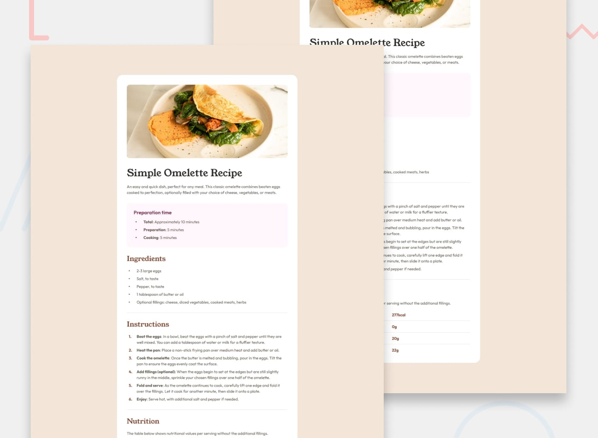
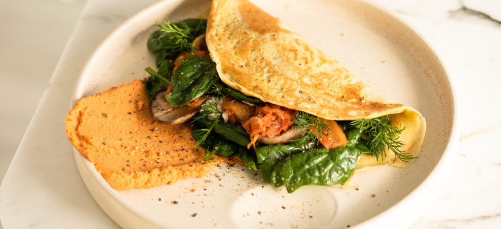

# Frontend Mentor - Recipe page solution

This is a solution to the [Recipe page challenge on Frontend Mentor](https://www.frontendmentor.io/challenges/recipe-page-KiTsR8QQKm). Frontend Mentor challenges help you improve your coding skills by building realistic projects.

## Table of contents

* [Overview](#overview)

  * [The challenge](#the-challenge)
  * [Screenshot](#screenshot)
  * [Links](#links)
* [My process](#my-process)

  * [Built with](#built-with)
  * [What I learned](#what-i-learned)
  * [Continued development](#continued-development)
  * [Useful resources](#useful-resources)
  * [AI Collaboration](#ai-collaboration)
* [Author](#author)
* [Acknowledgments](#acknowledgments)

## Overview

### The challenge

The challenge was to build a responsive recipe page based on the provided Frontend Mentor design.

The page presents a simple omelette recipe with:

* A recipe image
* Recipe title and description
* Preparation time
* Ingredients
* Step-by-step instructions
* Nutritional information

The implementation was built from scratch using semantic HTML and a CUBE CSS-inspired architecture.

### Screenshot



### Links

* **Solution URL**: [GitHub repository](https://github.com/Icequebe/fem-recipe-page)
* **Live Site URL**: [Live demo]()

## My process

I started by structuring the page using semantic HTML5 elements and then organized the CSS into separate layers based on responsibility.

The stylesheet follows a CUBE CSS-inspired structure:

```text
CSS

├── Tokens
├── Global
├── Composition
├── Utilities
└── Blocks
```

The CSS architecture separates design tokens, global styles, reusable layout compositions, utility classes, and component-specific styles.

This keeps the styling organized by responsibility while providing a structure that can be extended as the project grows.

### Built with

* Semantic HTML5 markup
* CSS custom properties
* CSS Grid
* CSS Flexbox
* Responsive media queries
* Native CSS nesting
* Modern viewport units
* HSL color values
* CUBE CSS-inspired architecture
* Responsive design
* Local font assets
* Accessible HTML elements

### What I learned

#### 1. Structuring CSS by responsibility

One of the main things I practiced in this project was separating different types of CSS instead of putting everything into one stylesheet.

The project uses dedicated layers for tokens, global styles, composition, utilities, and blocks.

```text
css/

├── tokens/
│   ├── font.css
│   └── variables.css
│
├── global/
│   ├── reset.css
│   └── base.css
│
├── composition/
│   ├── wrapper.css
│   └── stack.css
│
├── utilities/
│   ├── flow.css
│   └── region.css
│
├── blocks/
│   └── card.css
│
└── style.css
```

This makes the stylesheet easier to navigate and separates global concerns from reusable layout patterns and component-specific styling.

#### 2. Using design tokens

Instead of repeatedly writing raw colors, fonts, font sizes, font weights, and border-radius values, I created reusable CSS custom properties.

```css
:root {
  --card-bg: hsl(0 0% 100%);
  --page-bg: hsl(30 54% 90%);
  --line-bg: hsl(30 18% 87%);
  --text-bg: hsl(30 10% 34%);
  --head-bg: hsl(24 5% 18%);
  --meta-bg: hsl(14 45% 36%);
  --prep-tx: hsl(332 51% 32%);
  --prep-bg: hsl(330 100% 98%);

  --ff-head: "Young Serif", Arial, Helvetica, sans-serif;
  --ff-body: "Outfit", Georgia, "Times New Roman", Times, serif;

  --fw-400: 400;
  --fw-600: 600;
  --fw-700: 700;

  --radius-1: 1.75rem;
  --radius-2: 1.125rem;
  --radius-3: 0.5625rem;
}
```

Using design tokens makes the visual system easier to maintain and provides a foundation for making future design changes consistently.

#### 3. Using semantic HTML

The recipe content is structured using semantic elements such as:

```html
<main class="wrapper">
  <article class="card stack">
    

    <div class="card-text stack">
      <section class="card-desc">
        ...
      </section>

      <section class="card-prep">
        ...
      </section>

      <section>
        ...
      </section>

      <section>
        ...
      </section>

      <section>
        ...
      </section>
    </div>
  </article>
</main>
```

The recipe itself is contained within an `<article>` because it represents a self-contained piece of content.

I also used:

* An unordered list for ingredients
* An ordered list for recipe instructions
* A table for nutritional information
* Heading elements to establish the content hierarchy
* `aria-labelledby` to provide an accessible name for the recipe article

The ordered list is particularly appropriate for the instructions because the sequence of the cooking steps matters.

#### 4. Creating reusable layout compositions

The project uses reusable composition classes rather than putting every layout rule directly into the recipe card.

The `.wrapper` composition uses CSS Grid to center the main content:

```css
.wrapper {
  display: grid;
  place-items: center;
}
```

The `.stack` composition creates a reusable vertical layout using Flexbox:

```css
.stack {
  display: flex;
  flex-direction: column;
  gap: var(--stack-space, 2em);
}
```

The spacing can also be customized locally through the `--stack-space` custom property.

For example:

```css
.card-image {
  --stack-space: 0;
}
```

This approach allows the same composition to be reused without creating multiple versions of the component.

#### 5. Using flow-based spacing

The `.flow` utility provides vertical spacing between adjacent elements:

```css
.flow > * + * {
  margin-block-start: var(--flow-space, 0.5em);
}
```

Instead of assigning margins individually to every heading, paragraph, or list, the flow utility creates a consistent vertical rhythm.

The spacing can also be adjusted using the `--flow-space` custom property:

```css
.card-desc {
  --flow-space: 1em;
}
```

This keeps spacing contextual without requiring additional utility classes.

#### 6. Responsive component design

The recipe card changes its presentation based on the viewport width.

On smaller screens, the card uses the full available width and does not have rounded outer corners.

At larger viewport sizes, the card receives:

* A maximum width
* Internal padding
* Rounded corners
* A rounded recipe image
* Increased heading size
* Additional page spacing

The responsive behavior is handled using a modern media query:

```css
.card {
  background-color: var(--card-bg);
  border-radius: 0;

  @media (width >= 48em) {
    max-width: 45rem;
    padding: 2.25rem;
    border-radius: var(--radius-1);
  }
}
```

This allows the same HTML structure to adapt between mobile and larger screens without requiring separate markup.

#### 7. Using modern CSS features

The project uses several modern CSS features to keep the stylesheet concise and maintainable.

These include:

* Native CSS nesting
* Logical properties such as `padding-block` and `margin-block`
* Modern media query range syntax
* Modern viewport units such as `svh`
* CSS custom properties
* CSS Grid
* Flexbox

For example, the page uses:

```css
body {
  min-height: 100svh;
}
```

and:

```css
@media (width >= 48em) {
  ...
}
```

These features help keep the CSS aligned with modern browser capabilities while maintaining a relatively simple architecture.

#### 8. Improving accessibility

Accessibility was considered as part of the HTML and CSS implementation.

The recipe image includes descriptive alternative text:

```html

```

The article also references the main heading:

```html
<article class="card stack" aria-labelledby="recipe-title">
  <h1 id="recipe-title">Simple Omelette Recipe</h1>
</article>
```

The nutrition table uses row headers with an explicit scope:

```html
<th scope="row">Calories</th>
```

The reset also includes support for users who prefer reduced motion:

```css
@media (prefers-reduced-motion: reduce) {
  ...
}
```

These details helped me consider accessibility as part of the structure rather than treating it as something added after the visual design.

### Continued development

For future projects, I want to continue improving:

* CSS architecture and component organization
* Design-token systems
* Responsive typography
* Accessibility
* Semantic HTML
* Advanced responsive layouts
* Reusable CSS compositions and utilities
* Consistent spacing and sizing scales
* Modern CSS features
* More systematic component design

I also want to continue refining how I use CUBE CSS principles while keeping the architecture appropriate for the size and complexity of each project.

The goal is not to create unnecessary layers, but to use each layer when it provides a clear benefit to maintainability and reuse.

### Useful resources

* [Frontend Mentor](https://www.frontendmentor.io/) - Used for the original challenge and design reference.
* [MDN Web Docs](https://developer.mozilla.org/) - Useful reference for HTML, CSS, accessibility, and modern web platform features.
* [CUBE CSS](https://cube.fyi/) - Used as a reference and source of inspiration for the CSS architecture.

### AI Collaboration

AI tools were used as part of the development and documentation process.

#### Tools used

* ChatGPT
* Claude

#### How they were used

AI assistance was used for:

* Reviewing the project structure
* Discussing CSS architecture
* Reviewing HTML and CSS implementation
* Identifying potential issues and inconsistencies
* Improving project documentation
* Refining the README
* Exploring better approaches to responsive CSS
* Discussing maintainable styling approaches

The implementation itself was organized around understanding the underlying HTML and CSS rather than relying on AI to replace the development process.

#### What worked well

AI collaboration was particularly useful for reviewing architecture, identifying potential improvements, and explaining alternative approaches.

It also helped turn implementation decisions into clearer documentation that can be useful when revisiting the project later.

## Author

* Frontend Mentor - [@Icequebe](https://www.frontendmentor.io/profile/Icequebe)
* GitHub - [@Icequebe](https://github.com/Icequebe)

## Acknowledgments

Thanks to [Frontend Mentor](https://www.frontendmentor.io/) for providing the challenge and design resources used to build this project.

The challenge provided a useful opportunity to practice semantic HTML, responsive CSS, component organization, CSS architecture, accessibility, and design-system fundamentals.
